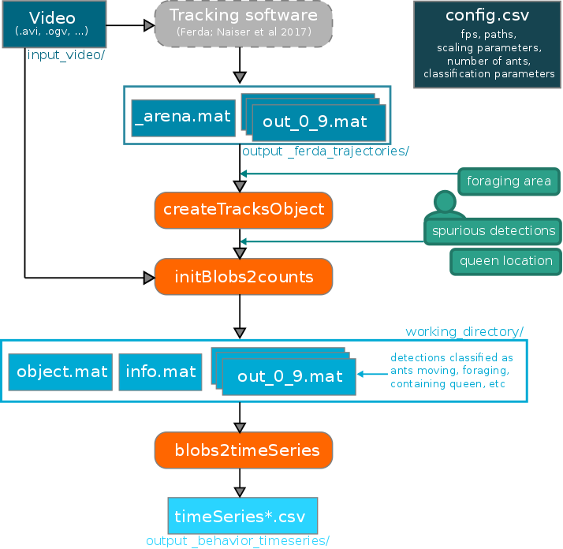

# colony-development

## Overview
Scripts and sample data to compute colony behavior proxies from motion trajectories for:

Early queen infection shapes developmental dynamics and induces long-term disease
protection in incipient ant colonies

by Barbara Casillas-Pérez, Christopher D. Pull, Filip Naiser, Elisabeth Naderlinger, Jiri Matas, Sylvia Cremer,

(in revision)

## Description
The scripts contained here take the output from video tracking ant colonies and compute a set of time series, that contain proxies of behavior of the colonies in the video. The process is tailored to videos picturing both ant workers and the colony queen, and is specially tolerant to imperfect video tracking results, i.e. under segmented detections containing multiple worker ants and/or the much larger ant queen. In brief, detections are first analyzed to estimate the number of ants contained within each, and then, aggregation, movement and region of interest statistics are computed.

The input, described in detail below, is a set of files containing the trajectories extracted from a video file, the video file itself, and some metadata. For the purpose of this work, a trajectory is understood as a series of frame-specific detections (the result of a segmentation algorithm on a video frame) which are identified as belonging to the same ant or group of ants. The method is robust to some of these detections being spurious (e.g. debris or shadows).

The scripts first convert the format of the trajectories into a memory-mapped file, in order to support very large trajectories. In this step, some of the trajectories are immediately classified as actively moving ants, based on parameters provided (e.g. displacement, speed and size threshold, see configuration described below). In the next steps, the user is prompted for input, to initialize the process and to correct potential problems with the tracking output. In particular, the user is prompted to define an area of interest (e.g. foraging arena) and inspect a series of video frames in which the detections of the tracker are superimposed, and to manually annotate which detections are spurious, and which contain the queen. The user input is also used to calibrate the image processing steps for the specific input video, to determine how many ants are present in each of the detections output by the tracker. Once the position of all ants and queen is determined, a series of frame-specific values are computed and output as a CSV, for the video in question.

See the publication linked to this repository, which connects the computed colony behavior proxies with colony composition, and both to colony overwintering survival. Below, the whole process and the format of the input and output files is described in detail, so that the user can adapt the output of any tracking software to produce behavior-relevant time series.



The data flow diagram summarizes the sequence of execution of the main scripts (in orange), the files they exchange (in shades of blue) and the user input (in green). A sample video, the corresponding trajectory files, and a configuration file are provided in the repository folder `sample_data`, to run with scripts in `behavioral_var_computation`.  

## Prerequisites
* Matlab 2015a or later on a UNIX environment.
* The input data, described in detail below, consisting of video, trajectories, and metadata.
* The trajectory files will be copied and the copies will have their size duplicated, so space should be available for this.
* After calibration, expect a processing time equal to half the video duration, if executed on a single machine. Running in a parallel environment is possible (see below), in which case the video file must be accessible to all processes.
* The limiting factor for execution time is access to disk, so storing both video and trajectories in an SSD is recommended.
* In general, enough memory should be available to load a couple hundred video frames, and two of the trajectory files provided.
* These scripts have been tested on a machine with 8GiB RAM, analyzing 180 minute, 1024x1024 pixel videos, which contain up to 100 worker ants.

## Expected input
The input is expected to be contained within a single directory. **All the paths described below are relative to the root of this directory.** It can include several videos and their corresponding trajectory files. Additional configuration variables should be contained in a configuration file. We provide examples of these files: `sample_data`, and describe their contents in detail below.

### Trajectories
The input trajectories are the result of video tracking done on a video of a single colony placed in a circular arena. It is necessary that the number of worker ants be constant throughout the observation period, that a queen be present, and that lighting conditions do not change drastically. The observation period, for which the tracking was computed, can start at an offset relative to the start of the video.
The tracking software we have used to obtain trajectories is available at: https://github.com/Flipajs/FERDA/tree/STABLE_colonies. The files are `.mat` loadable with Matlab. To each video correspond a series of `out_x-y.mat` files and a `_arena.mat` file.

#### Trajectories files: `out_X-Y.mat`
This is a series of files containing the trajectories that the tracking software extracted from the video file. We have processed our videos by parts, in parallel, hence the output is split into several parts. The files ordering is determined by the `X` and `Y` portions of their names. The first file must be named `out_0-{(N+1)-1}.mat` where `N+1` equals the parameter `size_of_parts`, specified in the configuration file. The second file must be named `out_{(N+1)}-{2(N+1)-1}.mat`, the third `out_{2(N+1)}-{3(N+1)-1}`, and so on. See the files in the `sample_data/output_ferda_trajectories` directory for an example.

Each file contains a single cell object called FERDA (e.g. `class(FERDA)` yields `cell`). This object is a cell array of Matlab structs, so that `class(FERDA{1})` yields `struct`. Each of these structs represents a *trajectory*: a series of detections that the tracker considers to be a single object across a number of frames (`nframes`). A detection represents a region in space given by a contour and a centroid. Each trajectory contains several fields, some of which are scalars and some of which are arrays with `nframes` elements:

| field name | content |
| ------------- |:-------------|
|x | an array of `nframes` floats containing the x (horizontal) coordinate of the center of the detection
|y | an array of `nframes` floats containing the y (vertical) coordinate of the center of the detection
|area | an array of `nframes`  integers containing the number of pixels contained in each detection
|frame_offset | an integer: the 0-based frame number to which this detection corresponds (0 meaning the trajectory starts at the `video_start` parameter contained in the metadata csv file)
|region_id | an array of `nframes`  integers corresponding to global-identifier of the detection. Currently ignored.
|region | a cell array, each of whose `nframes` elements is a struct with fields `x` and `y`. These fields are, in turn, arrays of integers, such that the pixel with coordinates `(FERDA{t}.region{i}.x, FERDA{t}.region{i}.y)` is inside, or in the border, of the region that comprises the `i`-th detection of trajectory `t`. This means that `size(FERDA{t}.region{i}.x)=size(FERDA{t}.region{i}.y))=FERDA{t}.area(i)` is the number of pixels contained in the `i`'th detection of trajectory `t`,
|region_contour | a cell array, each of whose `nframes` elements is a struct with fields `x` and `y`. These fields are, in turn, arrays of integers, such that the pixel with coordinates `(FERDA{t}.region_contour{i}.x, FERDA{t}.region_contour{i}.y)` is a pixel in the contour (border) of the `i`-th detection of trajectory `t`.
|mean_squared_displacement | a float: the [mean squared displacement](https://en.wikipedia.org/wiki/Mean_squared_displacement) of this trajectory.

#### Arena information: `_arena.mat`
This file contains information about the region of the image that is being analyzed (e.g. the experimental arena, Petri dish). It contains a single *struct* called `arena` that contains the following fields:

| field name | content | example |
| ------------- |:-------------| :-----|
|x1 | x (horizontal) coordinate of the upper-left corner of box bounding the arena | 31
|x2 | x (horizontal) coordinate of the lower-right corner of box bounding the arena | 983
|x1 | y (vertical) coordinate of the upper-left corner of box bounding the arena | 16
|x2 | y (vertical) coordinate of the lower-right corner of box bounding the arena | 969
|cx | x (horizontal) coordinate of the center of the arena | 476.48
|cx | y (vertical) coordinate of the center of the arena | 476.00
|radius | radius (in pixels) of the arena | 475.73

To illustrate the use of the bounding box, suppose `I` is a Matlab 3D (rows x colums x channels) array containing a frame of the video. This array can be cropped as follows: `I=I(arena.y1:arena.y2,arena.x1:arena.x2,:);` **The coordinates included in the trajectories files are relative to this bounding box**.

### Video file
This file should be the same as was used for tracking. It will be used both to prompt the user for input, and to compute, based on image intensity, the number of ants present inside a given detection.

Make sure Matlab can read the video files that are going to process. In the sample data we provide an *ogv* file, and the script has also be tested with *avi* files encoded in *mjpeg*. To test if Matlab can read the video, you can do `v=VideoReader('yourvideo.file');` in Matlab; which should return no errors. If you are running in GNU/Linux, make sure to use your local version of gclib, by starting Matlab like this:
`LD_PRELOAD=/usr/lib/x86_64-linux-gnu/libstdc++.so.6:/lib/x86_64-linux-gnu/libgcc_s.so.1 ./Matlab`, and that you have installed an up-to-date version of the gstream library.

### Configuration file
 * Called `config.csv`
 * Must be in the root of the data directory
 * Contains one row per video file
 * Must have the headers row with the titles as specified below (you can copy the header row from the sample file)
 * For each video file, the following info must be provided:  

| variable name | content description | example |
| ------------- |:-------------| :-----|
|project_name | an identifier for the video, that will help identify output results. It will be used as part of paths, so better not use spaces or weird characters  |sampleC5T1|
|path_video | path of the video file, relative to the root of the data directory | input_video/C5T1_clip3000frames.ogv |
|fps | frames per second in which the video was recorded |15|
|video_start | frame number from which the video tracking started i.e. this frame number will be considered as frame number 1 in the trajectories |500|
|path_FERDA_output | path where the trajectories are stored | output_ferda_trajectories|
|number_of_parts | number of files in which the trajectories are distributed| 3|
|size_of_parts | the files containing the trajectories are named `out_x-y.mat` starting with `x=0`, this parameter is equal to `y-x+1`, and must be the same for all files |10|
|single_threshold | maximum area, in mm^2 , that a detection must have to be immediately classified as a single ant |1.8|
|msd_threshold | minimum mean squared displacement, in mm^2, that a detection must have to be immediately classified as a single ant |1.3|
|speedThreshold | minimum speed, in mm / s, that an ant must sustain to be considered actively moving |5|
|arena_diameter_mm | diameter, in mm, of the arena in which the ants are recorded. This is used to compute a pixel to mm conversion, and can be manually refined later |90|
|path_behavioral_timeseries | path,  relative to the root of the data directory, in which the resulting time series will be saved |output_behavior_timeseries|
|ants_counted | number of worker ants that are present in the video |14|


### Important setup-specific parameters
The number of ants per detection area is described by the following equation:  `count = round (0.0027* blob_area * single_mean_model/single_mean + 0.54` where `blob_area` is the area of the detection in question and `single_mean_model/single_mean` is a quotient between the mean area of single detections in the video being processed and the video with which the model was adjusted.  The model is hard-coded in `count_model.m` (line 14) and was fit after manually counting the number of ants inside detections which did not contain the ant queen. The parameters are specific to our experimental setup, and should be adjusted for different setups.

Likewise, `single_threshold`, `msd_threshold` and `speedThreshold`, specified in the configuration file, are criteria considered after looking at the statistics of trajectories verified to contain single ants, and actively moving ants, in our experimental setup, and should be adjusted for different setups.

## Running
Use the script `main.m` in the `behavioral_var_compilation/` folder.
This script contains three important variables that can be tuned:

| variable | effect |default value |
| ------------- |:-------------| -------: |
|datadir  | The directory where the data is. This directory contains the csv file with metadata, as well as the different folders containing input (as specified in the csv) and the folder where the output is to be written to | '../sample_data/'
|n_exp  |  the number of row in the csv file which is to be analyzed. This line could be replaced by a for loop to analyze several videos  | 1
|resume | determines whether to start over the process if any progress has been recorded (which happens after each of the three steps defined below) | 1

 The `main.m` script will run three processes in succession:
 1. Conversion of input trajectory files into a memory-mapped file
 2. User-guided initialization, in order to calibrate the next steps
 3. Computation of the time series containing behavioral variables

### 1. Converting the input trajectory files into a memory-mapped file.
This process creates an object of the class `tracks`, as defined in the file `tracks.m`. This object is the single point of access to all trajectories (also known as *tracklets*), and automatically takes care of loading into memory the correct *parts* file (those with filename  `part_X-Y.out` ) when information about a specific trajectory is requested. This is useful when the size of trajectory files is too large to fit in memory, which can easily happen with very long videos, or those containing many workers.

The tracks object is created by a call to the constructor such as
`trx = tracks(path_FERDA_output, number_of_parts, size_of_parts, msd_threshold, single_threshold, arena_diameter_mm, forceRecreate)`
These parameters have the same meaning as the columns of the same name contained in the CSV file (see above). Additionally, if `forceRecreate=1`, the object file will be re-created from the raw input files, clearing any additional information that might have been saved into the *parts* files.

The most useful properties of the resulting object are listed below:
| property | content |
| ------------- |:-------------|
|numTracksTotal | the total number of trajectories contained in all the *parts* files. Trajectories can be accesed directly with the `get_tracklet` method (see below) by passing the trajectory number, which is between 1 and `numTracksTotal`
|listAlivePerFrame | a cell array, whose `i`-th element is a list of trajectory IDs which are present in frame `i` of the video
|types | for every trajectory, the inferred type of detection (see below)

Additionally, two of the methods are specially useful:
| method | parameters |effect |
| ------------- |:-------------| :-------------|
|get_tracklet | trajectory number | returns a trajectory struct corresponding to the specified index. This index is global (i.e. each trajectory in the entire video is assigned a single number, regardless of the *parts* file in which it is saved) and goes from `1` to the value of the `numTracksTotal` property of the tracks object.
|modify_propety | trajectory number, property to modify, [index] new value | changes a given property in a trajectory (see fields below). If index is provided, then the property is assumed to be an array (e.g. area) and index defines which element of the array will be changed. This method must be used whenever altering the information about a trajectory, as it will automatically take care of loading and saving the corresponding *parts* file.

The result of a call to `get_tracklet` is a trajectory struct, that has the following fields, several of which are verbatim copies of those listed above for the FERDA output

| field name | content |
| ------------- |:-------------|
|x | an array of `nframes` floats containing the x (horizontal) coordinate of the center of the detection
|y | an array of `nframes` floats containing the y (vertical) coordinate of the center of the detection
|area | an array of `nframes`  integers containing the number of pixels contained in each detection
|frame_offset | an integer: the 0-based frame number to which this detection corresponds (0 meaning the trajectory starts at the `video_start` parameter contained in the metadata csv file)
|region_id | an array of `nframes`  integers corresponding to global-identifier of the detection. Currently ignored.
|region | a cell array, each of whose `nframes` elements is a struct with fields `x` and `y`. These fields are, in turn, arrays of integers, such that, if `a` is trajectory, the pixel with coordinates `(a.region{i}.x, a.region{i}.y)` is inside, or in the border, of the region that comprises the `i`-th detection of trajectory `t`. This means that `size(a.region{i}.x)=size(a.region{i}.y))=a.area(i)` is the number of pixels contained in the `i`'th detection of trajectory `a`.  
|contour | a cell array, each of whose `nframes` elements is a struct with fields `x` and `y`. These fields are, in turn, arrays of integers, such that, if `a` is a trajectory the pixel with coordinates `(a.contour{i}.x, a.contour{i}.y)` is a pixel in the contour (border) of the `i`-th detection of trajectory `a`. It is identical to the `region_contour` field in the original file output by FERDA.
|msd | a float: the [mean squared displacement](https://en.wikipedia.org/wiki/Mean_squared_displacement) of this trajectory.
|firstframe | the first frame in which this trajectory appears in the video
|off | an offset that can be added to a global frame number to convert it into an index of this this object's time series (e.g. the `x` or `contour` field). Thus, if `a` is a trajectory , and we wish to see what the contour of this trajectory looks like in frame `f` of the video, we can access `a.contour(f+a.off)`
|endframe | the last frame in which this trajectory exists
|counter | an array of `nframes` integers that saves the number of estimated ants contained within the contour of the trajectory in each of its frames.
|type | an integer that stores the type of trajectory this is determined to be: `0` being unknown, `1` being a single ant, `2` being a queen, and `-1` being a spurious trajectory.
|velocity | the instantaneous speed, in pixels per frame, of the trajectory in each of the fields it is alive in. Note that the first item of this array is always `NaN`

### 2. User-guided initialization, in order to calibrate the next steps
In this step, the user is prompted a couple of times for information that can help refine the quality of the trajectories. This process can be executed separately with the script `initBlobs2Counts.m`.
The objectives of this process are:
* Calibrating parameters used to classify which trajectories are spurious detections
* Calibrating parameters used to determine which of the trajectories present in a given frame corresponds to the ant queen
* Calibrating parameters (intensity thresholds, speeds) used to refine image segmentation in order to estimate the number of ants present in a given detection as a function of the number of pixels contained in it.
* Refine the pixel to mm conversion rate.
* Selection of areas that are considered *foraging areas* when the time series is computed.

There are three steps in this process:
1. **Refinement of the arena location and determination of foraging area** The user is prompted to delimit areas of interest that will be marked as foraging. When all desired areas have been drawn, press `Y` in the command prompt. Afterwards, the arena's area is super-imposed on the image and can be adjusted for size and position, when finished, double click on the ellipse.

2. **Manual annotation of a subset of frames to calibrate queen and spurious detection criteria** The user is prompted a series of at least ten frames to left-click on the detection corresponding to the queen, and right click on any spurious detections. After these ten frames are annotated, the whole set of trajectories are analyzed and, if the queen's location is lost for more than a certain number of frames, the user is prompted again to locate it.

3. **Calibration of luminosity threshold for area estimation**
Finally, a frame is shown to the user on which contours computed based on eight different luminosity thresholds are superimposed. The user is prompted (on the command line) to choose the threshold value in which the contours are better fitting to the ants (i.e. that shadows or other objects don't share a contour with an ant). If the user presses `0` a new frame is displayed.

### 3. Computation of the time-series containing behavioral variables
Finally, the behavioral output table is created. This process can be executed separately with the script `blobs2TimeSeries.m`.
The variables collected or computed are described below:

| variable | description |
| ------------- |:-------------|
|frame| The frame number in which the variables were computed
|numActive| number of ants actively moving
|speedActive| average speed of active ants (mm/s)
|speedAll| average speed (mm/s)
|distAll| average pairwise distance between all ants (mm)
|distActive| average pairwise distance between active ants (mm)
|distQueen| average distance of each ant to the centroid of the detection containing the queen (mm)
|distClosest| average distance to the closest ant (mm) ~genneral aggregation (mm)
|queenCount| number of ants inside the detection containing the queen
|numForager| number of ants inside the foraging area (user delimited)
|queenArea| size of detection containing the queen (sqmm)

The list of relevant variables that can be computed from motion trajectories is, naturally, project specific. 

## Notes to parallelize
The time-series computation might take a long time, depending, among others, on the number of trajectories present. This can be alleviated if several machines are available, all of which have access to the video file and a matlab installation. Parallelization can be achieved by distributing the different `part_X-Y.mat` files to the different machines, and having them execute the computation on each file.  If a computing node is to execute this on the `n`-th parts file of the `m`-th experiment in the input file, it should execute a script similar to

```
% set datadir, m and n varialbes, possibly from bash script launching matlab

params_all_experiments = table2struct(readtable(strcat(datadir,'config.csv')));
workingdir=strcat(datadir,'working_directory/');
params = params_all_experiments(m);
projpath = strcat(workingdir,params.project_name,'/');
params.path_FERDA_output = projpath;
params.path_video_file=strcat(datadir,params.path_video_file);
params.path_behavioral_timeseries=strcat(datadir,params.path_behavioral_timeseries);

trx = createTracksObject(params.path_FERDA_output, ...
                   params.number_of_parts, ...
                   params.size_of_parts, ...
                   params.msd_threshold, ...
                   params.single_threshold, ...
                   params.arena_diameter_mm, 0);

videoFileName=params.path_video_file;
v=VideoReader(videoFileName);

[outputfilename, trx]=blobs2TimeSeries(resulDir , n ,trx,v);
```

By setting the `datadir` directory, it is possible to have the data files in a different path in each node (or at least different from the workstation in which the initialization process took place), as long as the relative paths inside that directory are preserved.

This approach has been tested both using Sun Grid Engine and Slurm.
